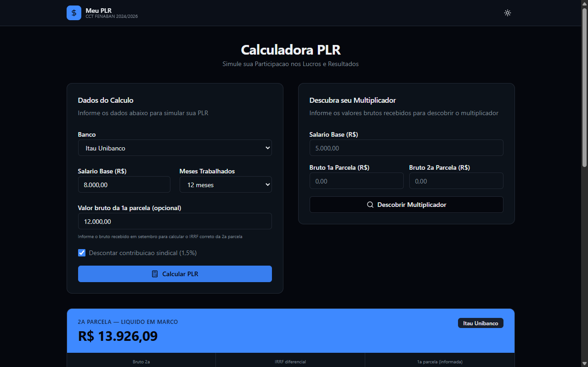
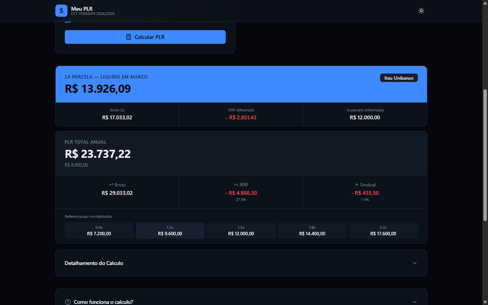
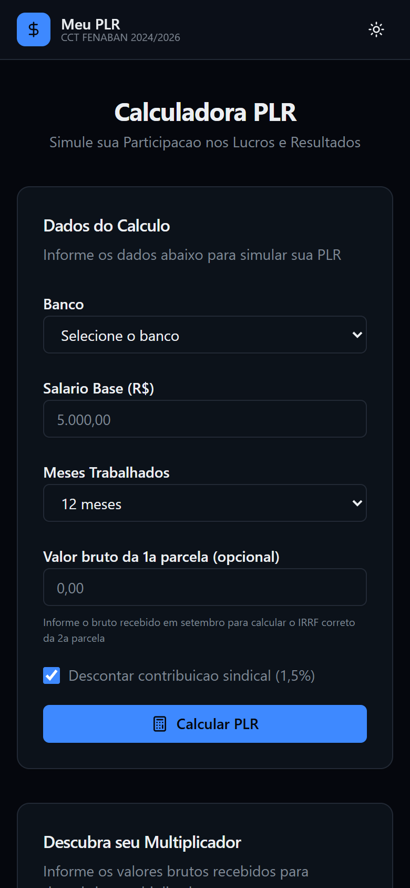

# Meu PLR

<div align="center">


[](https://github.com/JohnPitter/meu-plr/actions/workflows/ci.yml)

**Calculadora de PLR para Bancarios**

*Simule sua Participacao nos Lucros e Resultados com base na CCT FENABAN 2024/2026*

[Demo](https://johnpitter.github.io/meu-plr/) •
[Features](#features) •
[Screenshots](#screenshots) •
[Bancos](#bancos-suportados) •
[Getting Started](#getting-started)

</div>

---

## Overview

Calculadora completa de PLR (Participacao nos Lucros e Resultados) para bancarios brasileiros. Todos os calculos sao feitos localmente no navegador — nenhum dado pessoal e armazenado.

**O que voce consegue:**
- **Calculo por banco** — Regras especificas para Itau, Santander, Bradesco, BB, Caixa, BTG e Safra
- **IRRF correto** — Tabela exclusiva de PLR atualizada (Lei 14.663/2023)
- **2a parcela** — Calculo do IRRF diferencial com metodo proporcional usado pelos bancos
- **Multiplicador** — Descubra seu multiplicador a partir dos valores brutos recebidos
- **Escala de referencia** — Veja estimativas de 0.9x a 2.2x do seu salario

---

## Screenshots

### Calculadora


### Resultado


### Mobile


---

## Features

| Feature | Descricao |
|---------|-----------|
| **Calculo completo** | Antecipacao + exercicio + majoracao + parcela adicional |
| **7 bancos** | Itau, Santander, Bradesco, BB, Caixa, BTG, Safra |
| **IRRF Lei 14.663/2023** | Tabela exclusiva de PLR atualizada |
| **IRRF proporcional** | Metodo usado pelos bancos para distribuir IRRF entre parcelas |
| **Contribuicao sindical** | Desconto opcional de 1,5% |
| **PLR proporcional** | 1 a 12 meses trabalhados |
| **Descoberta de multiplicador** | Informe brutos e descubra seu multiplicador |
| **Escala de referencia** | Estimativas de 0.9x a 2.2x do salario |
| **Historico** | Calculos salvos localmente (localStorage) |
| **Dark/Light mode** | Tema claro e escuro |
| **Responsivo** | Desktop e mobile |

---

## Bancos Suportados

| Banco | Programa | Valor |
|-------|----------|-------|
| Itau Unibanco | PCR (Programa Complementar de Resultados) | R$ 4.299,86 |
| Santander | PPRS (Programa Proprio de Resultados) | R$ 3.880,84 |
| Bradesco | PRB (Programa de Remuneracao Bradesco) | R$ 0 (ROAE 2025 < 15,5%) |
| Banco do Brasil | Modulo BB | R$ 3.500,00 |
| Caixa Economica Federal | PLR Social | R$ 3.200,00 |
| BTG Pactual | Regra FENABAN generica | - |
| Banco Safra | Regra FENABAN generica | - |

---

## Getting Started

### Requisitos

| Requisito | Versao |
|-----------|--------|
| Node.js | 18+ |
| npm | 9+ |

### Instalacao

```bash
git clone https://github.com/JohnPitter/meu-plr.git
cd meu-plr
npm install
npm run dev
```

Acesse `http://localhost:5173/meu-plr/`

### Scripts

| Comando | Descricao |
|---------|-----------|
| `npm run dev` | Servidor de desenvolvimento |
| `npm run build` | Build de producao |
| `npm test` | Rodar testes (73 testes unitarios) |
| `npm run lint` | Lint do codigo |

---

## Stack

| Tecnologia | Versao | Uso |
|------------|--------|-----|
| React | 19 | UI |
| TypeScript | 5.9 | Tipagem |
| Vite | 7 | Build |
| Tailwind CSS | 4 | Estilizacao |
| Vitest | 4 | Testes |
| GitHub Actions | - | CI/CD |
| GitHub Pages | - | Deploy |

### Arquitetura

Clean Architecture com 4 camadas:

```
src/
  domain/          # Entidades, value objects, interfaces
  application/     # Use cases, DTOs
  infrastructure/  # Calculadoras (IRRF, PLR por banco)
  presentation/    # React components, hooks
```

---

## Documentacao

| Documento | Descricao |
|-----------|-----------|
| [Architecture](docs/ARCHITECTURE.md) | Arquitetura e decisoes tecnicas |
| [CCT Rules](docs/CCT-RULES.md) | Regras da CCT FENABAN |
| [Changelog](CHANGELOG.md) | Historico de mudancas |

---

## Disclaimer

Valores de referencia baseados na CCT FENABAN 2024/2026 (exercicio 2025). Consulte seu holerite e o sindicato para valores exatos. Esta ferramenta nao substitui orientacao profissional.

Esta aplicacao nao armazena nenhum dado pessoal. Todos os calculos sao feitos localmente no seu navegador.

---

## License

MIT - veja o arquivo [LICENSE](LICENSE).

---

## Contribuindo

Contribuicoes sao bem-vindas!
1. Fork o repositorio
2. Crie uma branch para sua feature
3. Envie um pull request

---

## Suporte

- **Issues:** [GitHub Issues](https://github.com/JohnPitter/meu-plr/issues)
